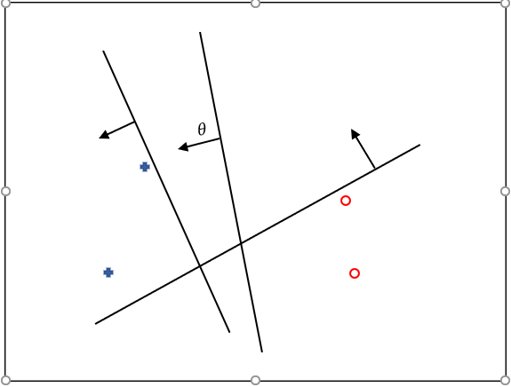
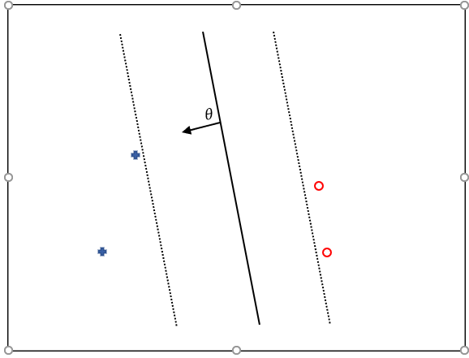
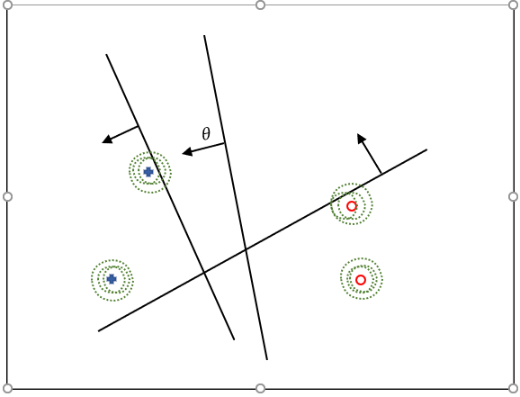
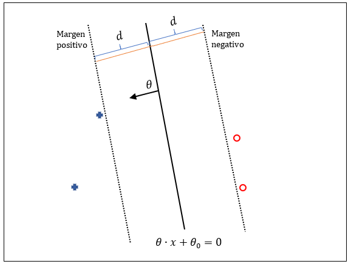
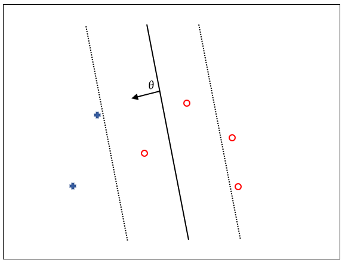
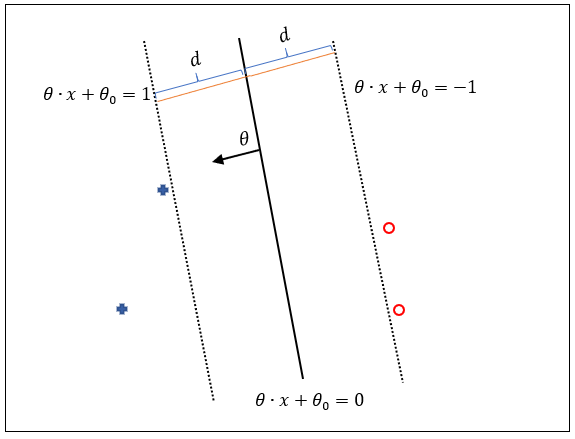
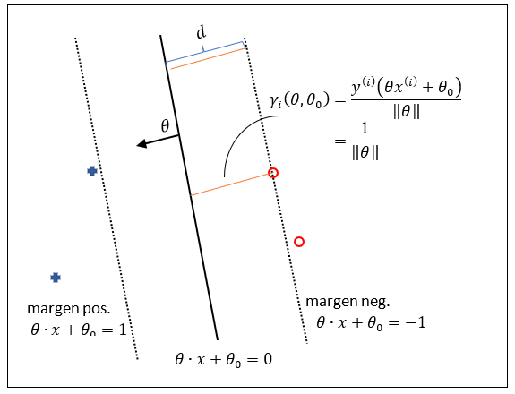

## Pérdida de bisagra, Límites de margen y Regularización

Se va ha ver como transformar problemas de aprendizaje automático en problemas de optimización. Es decir, como transformar el problema de encontrar un clasificador lineal en base al conjunto de datos de entrenamiento en un problema de optimización que se puede resolver de muchas formas.

### Introducción 

Se comienza con la nociones de **magen de perdida** y  **regularización** y la motivación de por qué se prefiere un margen grande.

Para los cuatro ejemplos de entrenamiento de la imagen siguiente, el algortimo perceptron podría seleccionar cualquiera de las soluciones de la imagen sin que se tenga una idea de cual de ellas elegiría.

Sin embargo, se deberia favorecer la solución que de alguna manera se está entre los dos conjuntos de ejemplos de entrenamiento, dejando cuanto más espacio en ambos lados mejor. Es lo que se denomina como **clasificador de margen grande**

Digamos que los ejemplos de prueba que vemos en el futuro son versiones ruidosas de los ejemplos de entrenamiento. Una nube de puntos alrededor de cada uno de los ejemplos de entrenamiento serán etiquetados de acuerdo con el ejemplo de entrenamiento correspondiente.

Se puede ver gráficamente, que el **clasificador lineal de gran margen** todavía clasifica correctamente todos esos ejemplos de prueba, **es más robusto**. Por el contrario, los otros clasificadores que estám muy cerca de los ejemplos de entrenamiento comienza a clasificar erróneamente esas versiones ruidosas de ejemplos de entrenamiento rápidamente.

Se va a ver, de forma progresiva, como se puede convertir un problema de búsqueda de un clasificador de margen grande en un problema de optimización.

Hay dos nuevos límites que llamaremos **límites de margen**. Hay un límite de margen en el lado negativo, y tenemos un límite de margen en el lado positivo. Estos límites **son equidistantes del límite de decisión real**.

El objetivo es usar estos límites de margen para definir un límite de decisión ancho que hay que ajustar con los ejemplos de entrenamiento. Por lo tanto, se intenta separar lo más posible estos límites de margen y esto obligara a mover el límite de decisión a un lugar que divida en dos este gran espacio vacío entre los dos conjuntos de ejemplos.

Hay dos elementos que hay que tener en cuenta cuando se convierte el problema a uno de optimización:
- Uno es, favorecer los límites de margen que están más separados del límite de decisión. Esto es lo que se denomina el **termino de regularización**.
- El otro es un contrapeso que, a medida que separamos estos límites de margen, tratando de ajustar el límite de decisión entre el conjunto de ejemplos, podríamos comenzar a violar el objetivo de que todos los ejemplos de entrenamiento están fuera de este límite ancho. Puede haber ejemplos que caigan dentro de este límite ancho o que incluso estén mal clasificados. 

    

    Este contrapeso se cuantifica en términos de una **función de pérdida** en la que podemos incurrir en cada uno de los ejemplos que no se ajusta a esta imagen ideal.

Estos dos elementos juntos definen una **función objetivo** para seleccionar los parámetros $\theta$ y $\theta_0$. Esta es un equilibrio entre la pérdida, cómo los ejemplos encajan dentro de esta noción ideal y la regularización, nuestra preferencia hacia soluciones de márgenes grandes.

### Límites de Margen
Lo primero que debemos hacer es definir cuáles son exactamente los **límites de margen** y cómo podemos controlarlos, lo lejos que están del límite de decisión. **El límite de decisión** lo forman los puntos que cumplen con la ecuación:

$$\boxed{\theta·x+\theta_0=0}$$

Si nos movemos en la dirección de *theta*, comenzaremos a tener valores más positivos. De forma similar, si nos movemos en la dirección opuesta de *theta*, se obtiene valores cada vez más megativos. Entonces podemos definir los **límites de margen** como el conjunto de $x$ donde esta función lineal es exactamente $1$ y $-1$.

$$\boxed{\begin{aligned}\theta·x+\theta_0 &=1 \\
 \theta·x+\theta_0 &=-1\end{aligned}}$$

Estos dos límites de margen son equidistantes del límite de decisión.

Ahora se puede intentar separarlos, ya que los límites de márgenes también están definidos por los parámetros que deseamos optimizar, $\theta$ y $\theta_0$.

Queda por averiguar la distancia a la que se encuentran los límites de margen del límite de decisión y cómo podemos controlarla.

Partiendo de la ecuación del límite de decisión $\theta·x+\theta_0=0$, se va a dividir por **la norma o longituid** del vetor de parámetros $\theta$:

$$\frac{\theta·x}{\Vert\theta\Vert}+\frac{\theta_0}{\Vert\theta\Vert}=0$$

Que también define el mismo límite de decisión. La **norma** se convierte en un **parámetro libre**, es un **grado de libertad** que da como resultado el mismo límite de decisión.

Se pued utilizar la norma para separar los límetes de margen del límite de decisión. 

Intuitivamente, si se mira a la función lineal  de los límites de margen, cuando se separan del límite de decisión, el valor de la función lineal se incrementa a una tasa que esta relacionada con la magnitud del vector de parámetros $\theta$. Así, cuanto más grande es la magnitudo de $\theta$, más rápido la función lineal del límite de margen alcanza su valor $\pm1$. Como resultado, **en términos de distancia al límite de decisión, cuanto más cerca esta el límite de margen al límite de decisión más grande es el valor de la norma de $\theta$**.

Por lo tanto, **la norma sirve para controlar la distancia** entre los límites de margen y el límite de decisión. 

La selección de los valores de los parámetros $\theta$ y $\theta_0$ no solo definen la orientación del límite de decisión, sino que también dónde se establecen los limites de margen.

Mas formalmente, este **término de regularización** permite controlar lo lejos que los límites de margen están del límite de decisión.

Dado un ejmplo de entrenamiento, $x^{(i)}$, con su correspondiente etiqueta, $y^{(i)}$, la **distancia**, $\gamma_i$, a la que este ejemplo está del límite de decisión viene dada por la siguiente ecuación

$$\boxed{\gamma_i(\theta, \theta_0)=\frac{y^{(i)}\big(\theta x^{(i)}+\theta_0\big)}{\Vert \theta \Vert}}$$

Por ejemplo, en el caso en el que el ejemplo $x^{(i)}$ está sobre el límite de margen negativo esta ecuación da como resultado:

$$\gamma_i(\theta, \theta_0)=\frac{\overbrace{y^{(i)}}^{\text{-1}}\big(\overbrace{\theta x^{(i)}+\theta_0}^{\text{-1}}\big)}{\Vert \theta \Vert}=\frac{1}{\Vert \theta \Vert}$$

Por lo tanto, el límite de margen está realmente a ${\frac{1}{\Vert \theta \Vert}}$ del límite de decisión.

Esto distancia se denomina **distancia con signo**. Es una distancia con signo porque además de medir la distancia de un punto al límite de decisión, también especifica en que lado se encuentra. Así, si se encuentra en el lado correcto del límite de decisión, la distancia es **positiva**. Pero si se encuentra en el lado incorrecto, la distancia será **negativa**.

**El objetivo de la regularización es máximizar la distancia entre los límites de margen y el limite de decisión**

$$\boxed{\max{\frac{1}{\Vert \theta \Vert}}}$$

### Función Pérdia de Bisagra y Función Objetivo
La **función objetivo** para encontrar márgenes grandes para el límite de decisión tiene dos componentes:
- Una **función de pérdida bisagra**.
$$Loss_h \Big(y^{(i)}\big(\theta x^{(i)}+\theta_0\big)\Big)$$
- Un **término de regularización**.
$$\max{\frac{1}{\Vert \theta \Vert}}$$

Cuantifiquemos cuanto es la función de pérdida. El **signo de la predicción lineal**
$$\theta x^{(i)}+\theta_0$$

nos dice como se ha clasificado el ejemplo $x^{(i)}$. Si se multiplica por la **etiqueta real** $y^{(i)}$, se obtendra un **valor positivo** cuando la predicción **coincide** con la etiqueta, y un **valor negativo** cuando la predicción **no coincide** con la etiqueta. Este argumeto de la función de pérdida se va a denominar **concordancia**. Que vamos denotar por $z$:

$$z = y^{(i)}\big(\theta x^{(i)}+\theta_0\big)$$

Teniendo en cuenta esto, se puede definir la **función de pérdida bisagra** como:

$$\boxed{\textrm{Loss}_h(z)=\begin{cases}
    0 &\text{si } z \geqslant 1 \\
    1-z &\text{si } z < 0
\end{cases}}$$

Que viene a decir que:
- si la *concordancia* $z$ es mayor o igual que $1$, el ejemplo $x^{(i)}$ está en el límite de margen o más alla y la pérdida es $0$.
- pero se empieza a penalizar con $1-z$ a cualquier ejemplo $x^{(i)}$ que penetra dentro del límite de márgen, donde $z$ es menor que $1$.

Recordar que la regularización tiene como misión maximizar la distancia de los limites de margen al límite de decisión. Esta distancia viene determinada por la inversa de la norma del vector de los parámetros, $\theta$. Pero maximizar la inversa de la norma es igual a minimizar la norma

$$\max \frac{1}{\Vert \theta \Vert} = \min \Vert \theta \Vert=\min \frac{1}{2}\Vert \theta \Vert^2$$

Se puede regularizar la solución intentando **penalizar los valores grandes** de la norma al cuadrado del vetor $\theta$.

La **función objetivo**, $J$, que guira la selección del vector de parametros $\theta$ y de $\theta_0$ tiene dos partes:

$$\boxed{J(\theta, \theta_0) = \frac{1}{n} \sum_{i=1}^nLoss_h \Big(y^{(i)}\big(\theta x^{(i)}+\theta_0\big)\Big) + \frac{\lambda}{2}\Vert \theta \Vert^2}$$

- Un promedio de pérdida donde cada termino de pérdida mide en cuanto viola ese ejemplo su límite de margen definido de acurdo col la función de pérdida bisagra
- La regularización  que trata de empujar los límites de margen cada vez más.

La función objetivo que guia la solución es un **compromiso** entre los dos términos. Este compromiso lo establecmos mediante un nuevo parámetro denominado **parámetro de regularización**, $\lambda>0$, que pondera como estos dos términos deben afectar a la solución.

- Para **grandes valores de $\lambda$** se favorece a las soluciones de márgenes grandes pero potencialmente a consta de una pérdida adicional a medida que los límites de margen superan a los ejemplos.
- Para **valores muy pequeños de $\lambda$** se favorece poner los ejemplos correctamente fuera de los límites de margen pero al coste potencial de mantener los límites de margen muy cerca del límite de decisión.

Los valores optimos para $\theta$ y $\theta_0$ se obtinene **minimizando la función objetivo**. Así, se ha transformado un problema de aprendizaje automático en un **problema de optimización**.

