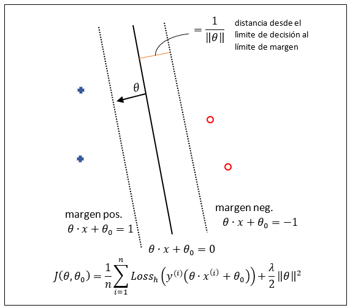
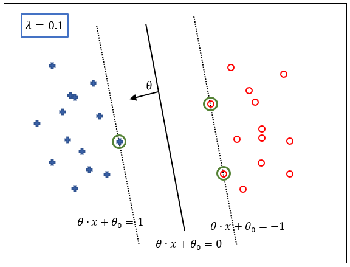
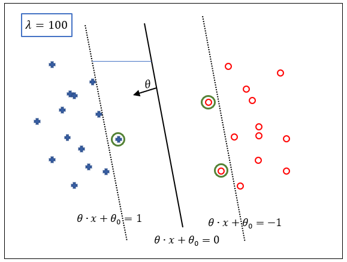
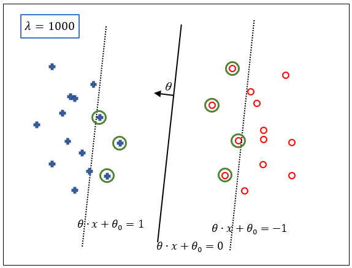
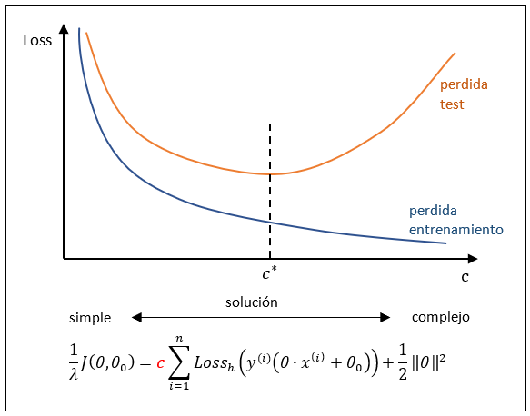
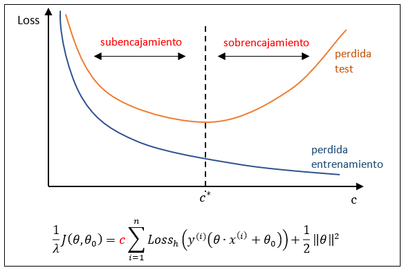
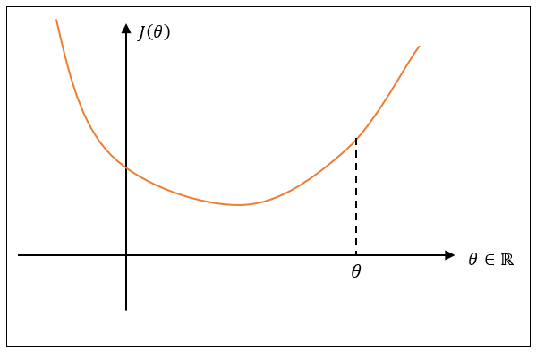
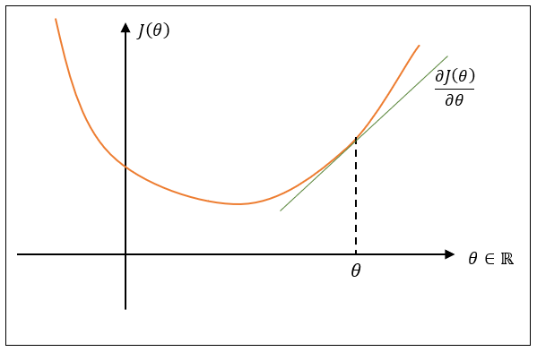
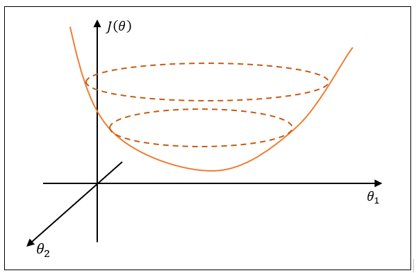

## Clasificación Lineal y Generalización
Los objetivos de este tema son
- Comprender la vista de optimización del aprendizaje
- Aplicar algoritmos de optimización como el gradiente descendente, el gradiente descendente estocástico y el programa cuadrático.

### Introducción y Revisión
Se ha visto como formular la clasificación lineal de margen máximo como un problema de optimización. Ahora se va a intentar comprender las soluciones a ese problema de optimización y como encotrar esas soluciones.

Asi la función objetivo se puede expresar como:

$$\textrm{funcion objetivo = perdida promedio + reguralrización}$$

El término **pérdida promedio** cuantifica los errores de predicción y el término de **regularización** promueve separadores lineales de margen máximo.

En el caso de la **máquina de vectores de soporte** la pérdida promedio es la **pérdida bisagra promedio** de la **concordancia** del **predictor lineal** de los ejemplos de entrenamiento

$$J(\theta,  \theta_0)= \frac 1 n \sum_{i=1}^n\textrm{Loss}_h\big(y^{(i)}(\theta\cdot x^{(i)} + \theta_0)\big)+\frac{\lambda}{2}\Vert\theta\Vert^2$$

Cuando la **concordancia** es menor que $1$, $y^{(i)}(\theta\cdot x^{(i)} + \theta_0)\lt1$, se empieza a incurrir en perdida. Ya que la **función de perdida bisagra**, $\textrm{Loss}_h$, se define como: 

$$\textrm{Loss}_h(z)=\begin{cases}
    0 &\text{si } z \geqslant 1 \\
    1-z &\text{si } z < 0
\end{cases}$$

Y el promedio de esta pérdida es lo que se pretende minimizar.

Por otro lado, se tiene el término de **regularización**, $\frac{\lambda}{2}\Vert\theta\Vert^2$. Minimizar este término supone separar cada vez más los **límites de margen**.

El **parámetro de regularización**, $\lambda$, controla el **balance** entre estos dos términos. Y la naturaleza de la solución varía en función de este parámetro de regularización.

Si el predictor lineal, $\theta\cdot x^{(i)} + \theta_0$, toma los valores $1$ o $-1$, los límites de margen están separados a una distancia de $\frac{1}{\Vert\theta\Vert}$ con respecto al límite de decisión. Por lo tanto, cuando se minimiza el termino de regularización, $\frac{\lambda}{2}\Vert\theta\Vert^2$, se está separando los límites de margen del límite de decisión. Y a medida que se hace esto, los límites de margen empiezan a absorver ejemplos de entrenamiento.

Asi, cuando se cambia el **parámetro de regularización** $\lambda$, se cambia el **balance** entre estos dos términos. 

- Cuanto más grande es el valor de $\lambda$, más se separan los límites de margen a costa de penalizar a más ejemplos de entrenamiento.
- Cuanto más pequeño es el valor de $\lambda$, más enfasis se pone en minimizar la pérdida promedio de los ejemplos de entrenamiento. En intentar clasificar correctamentde los ejemplos que están dentro de los límites de margen. Y los propios límites de magen comienzan a acercarse al límite de decisión.

Vamos a ver gráficamente como funciona esto.

Si se tiene un parámetro de regularización relativamente pequeño, $\lambda = 0.1$, se enfatiza la clasificación correcta de los ejemplos, y la solución que se obtiene esque todos los ejemplos están en el lado correcto del límite de decisión.

Si se comienza a incrementar el valor del parámetro de regularización

Se empieza a permitir que los límites de margen dejen algunos ejemplos dentro de su margen.

Si se incrementa más su valor

La solución cambia, la solución al problema de optimización será diferente. Cuanto más se alejen los límites de margen, la solución estará más influenciada por la totalidad de puntos que por solo los puntos que están más cerca del límite de decisión. 

### Regularización y Generalización
Se va a ver como el cambio en el valor del parámetro de regularización $\lambda$ cambia la pérdida o error promedio en los ejemplos de entrenamiento y test.

- A medida que se pone el foco en los márgenes, cada vez se es menos capaz de ajustar las muestras de entrenamiento, así que la pérdida aumenta.
- A medida que se disminuye el valor de $\lambda$, se pone el foco en la pérdida de la muestra de entrenamiento. Y como resultado, se encuentran  soluciones de $\theta$ y $\theta_0$ donde la pérdida de entrenamiento es menor.

Se va a ver como este comportamiento es una función del parámetro de regularización $\lambda$. Pero en lugar de verlo como función de $\lambda$ se va a ver como función de $\frac{1}{\lambda}$, ya que es más fácíl conceptualmente. Asi que ahora la función objetivo se convierte en:

$$\textcolor{red}{\frac{1}{\lambda}}J(\theta,  \theta_0)= \textcolor{red}{\frac{1}{\lambda n}} \sum_{i=1}^n\textrm{Loss}_h\big(y^{(i)}(\theta\cdot x^{(i)} + \theta_0)\big)+\textcolor{red}{\frac{1}{2}}\Vert\theta\Vert^2$$

Este ajuste no cambia los valores optimizados de $\theta$ y $\theta_0$. También, se va a denominar a $\frac{1}{\lambda n}$ como $\pmb{c}$ (complejidad). Asi si $c$ es grande, se pone el foco en la pérdida, si $c$ es pequeña, se pone el foco en los márgenes.

Se muestra como se comporta la pérdida en los ejemplos de entrenamiento y la pérdida en los ejemplos de test en función de $c$.

Las soluciones compleja encajan los ejemplos de entrenamiento mejor cuanto más grande es el valor de $c$. Sin embargo, para los ejemplos de text, a partir de un valor óptimo $c{^*}$ de $c$ el aumento de complejidad significa un aumento en la pérdida.

Por lo tanto, si se pudiera encontrar el valor de $c^{*}$ y obtener la solución en base al un conjunto de entrenamiento, se obtendría el mejor **método de generalización**, y se podría obtener la menor pérdida de test.

El valor de $c^{*}$, divide el problema en dos regímenes.

- **subencajamiento**. Bajo este régimen, al aumentar la complejidad, el valor de $c$, mejoramos el rendimiento en los datos de test.
- **sobrencajamiento**. Bajo este régimen, el aumento de complejidad, también aumenta la pérdida de los datos de test.

Para calcular el valor de $c^*$, se divide el conjunto de datos de entrenamiento en dos partes:
- **conjunto de datos de entrenamiento**, que es una porción más pequeña, 70-90%, del conjunto de datos de entrenamiento original y que sirve para entrenar al algoritmo de aprendizaje automático
- **conjunto de datos de validación**, que lo componen el 10-30% de datos restantes del conjunto de datos de entrenamiento original y sirve para poder obtener una estimación, $\hat{c}$, al valor optimo de $c$, $\hat{c}\approx c^*, $ que permita un mejor rendimiento de optimización.

### Gradiente Descendente

Hasta ahora, se ha visto cómo entender cualitativamente el tipo de soluciones que se obtiene cuando se varía el parámetro de regularización y optimizamos con respecto a $\theta$ y $\theta_0$.

Ahora, se intruducen algoritmos para encontrar esas soluciones. Como prefacio, introducimos muy brevemente qué es el **gradiente descendente**.

Primero se ve el ejemplo de un parámetro escalar $\theta$, es decir $\theta \in \R$, y una función objetivo con respecto a ese parámetro, $J(\theta)$. Se parte de un valor de $\theta$ y se va cambiando su valor para ir acercadose al mínimo de la función.

El proceso de encontar el mínimo de la función comienza calculando la pendiente de la función en el punto $\theta$. 

La pendiente viene dada por la derivada de la función objetivo, $J(\theta)$, con respecto al valor del parámetro $\theta$, $\frac{\partial J(\theta)}{\partial \theta}$.

Si la pendiente es positiva
- si nos movemos en la dirección positiva, incrementando $\theta$, se incrementara el valor de la función objetico $J(\theta)$. 
- si nos movemos en la dirección opuesta, decrementando $\theta$, se decrementa la función $J(\theta)$.

Así, la **regla de acutlización del gradiente descendente** es obtener un nuevo valor del parámetro $\theta$ a partir del valor anterior y moviendose en la dirección negativa de la derivada del gradiente de la función. Se va a incluir un nuevo parámetro denominado **tamaño de paso** o **tasa de aprendizaje** $\pmb{\eta}$ que controla el tamaño del paso en la dirección negativa del gradiente.

$$\theta \larr \theta - \eta \frac{\partial J(\theta)}{\partial \theta}$$

Si la función es adecuada, es decir fuertemente convexa, hay una pequeña tasa de aprendizaje constante que garantiza la obtención rápida del mínimo de la función. 

Si se tiene un caso multi dimensional, por ejemplo de 2 dimensiones, la función se parece a la siguiente.

En este caso la **regla de acutlización del gradiente descendente** tiene que actualilzar cada uno de los parámetros, $\theta_j$, moviendolas en dirección negativa a la derivada de la función con respecto a cada parámetro en particualar:

$$\theta_j \larr \theta_j - \eta \frac{\partial J(\theta)}{\partial \theta_j}$$

Esto se puede expresar en forma vectorial de la siguiente manera:

$$\pmb{\theta} \larr \pmb{\theta} - \eta \nabla J(\pmb{\theta})$$

Siendo $\pmb{\theta}$ el vector de los parámetros, y $\nabla J(\pmb{\theta})$, el gradiente de la función con respecto a los parámetros (matriz jacobina):

$$\nabla J(\pmb{\theta})=\begin{bmatrix} \frac{\partial J(\theta)}{\partial \theta_1} \\ \vdots \\ \frac{\partial J(\theta)}{\partial \theta_n}\end{bmatrix}$$

### Gradiente Descendente Estocástico

Hasta ahora, se ha definido la función objetivo como un promedio de la función de pérdida bisagra mas un término de regularización. Ahora, se va a incluir el término de regularización dentro del promedio ya que no depende de los ejemplos de entrenamiento. Así que cualquier promedio sobre esta nueva función devolvera lo mismo que antes. 

Para simplificar los cálculos, también se va a eliminar el parámetrod de desplazamiento $\theta_0$:

$$J(\theta)= \frac 1 n \sum_{i=1}^n \bigg[\textrm{Loss}_h\big(y^{(i)}(\theta\cdot x^{(i)})\big)+\frac{\lambda}{2}\Vert\theta\Vert^2\bigg]$$

La función objetivo $J(\theta)$ se puede ver como un promedio sobre la suma de los ejemplos de entrenamiento de un función objetivo específica de ejemplo más simple $J_i(\theta)$.

$$J(\theta)= \frac 1 n \sum_{i=1}^n J_i(\theta)$$

Una forma de ver la función objetivo es que realmente es una **esperanza** sobre estos términos $J_i(\theta)$ individuales. De esta forma, se puede actualizar los parámetros estocásticamente, tomando muestras aleatórias individuales de ejemplos de entrenamiento, $i$, calculando el valor de la función objetivo individual para ese ejemplo $J_i(\theta)$, y empujando los parámetros en la dirección que optimiza ese término individual. 

Y dado que caja ejemplo de entrenamiento $i$ empuja a los parámetros $\theta$ en una dirección ligeramente diferente, tomando estos pasos pequeños, en promedio, se va a mover en la dirección que optimiza a la función objetivo. Esta forma de optimizar la función objetivo es **más eficiente** que en el caso de hacerlo sobre toda la función objetivo.

El procedimiento seria el siguiente: 
- se obtiene un ejemplo $i$ de forma aleatoria del conjunto de ejemplos de entrenamiento $\{1, \ldots , n\}$
- se realiza una actualización de gradiente descendente de este ejemplo particular $i$, moviendo los parámetros $\theta$ en la dirección que pareze optimizar ese término particular $J_i(\theta)$ en la función objetivo $J(\theta)$.

$$\theta \larr \theta - \eta_t \nabla J_i(\theta)$$

Como se está introduciendo alguna aleatoriedad, es necesario disminuir el valor del parámetro tasa de aprendizaje $\eta_t$ para que el proceso converja.

Más concretamente, es necesario que $\eta_t \rarr 0$ como función de las iteraciones de esta actualización. Se pretende que 

$$\sum_{t=1}^{\infin} \eta_n=\infin$$

Lo que esto significa es que se conserva suficiente fuerza para poder empujar los parámetros, donde sea que se esté, hacia el mínimo. 

Pero, por otro lado, es necesario reducir la varianza que se está intruduciendo por la estocasticidad. Para ello, el parámetro $\eta_t$ tiene que cumplir con la propiedad denominada cuadrado-sumable, que significa que la suma de los cuadrados de sus valores tiene que ser finito:

$$\sum_{t=1}^{\infin} \eta_n^2 < \infin$$

Esta restricción se cumple si:

$$\eta_t = \frac{1}{1+ t}$$

Para resumir:
- se parte de la función objetivo reducida

$$J(\theta) = \frac{1}{n} \sum_{i=1}^n \bigg[\overbrace{\textrm{Loss}_h\big(y^{(i)}(\theta x^{(i)})\big) + \frac{\lambda}{2}\Vert\theta \Vert^2}^{J_i(\theta)} \bigg]$$

- se obtiene un muestra $i$ aleatoria de los ejemplos de entrenamiento
- se actualiza los parámetros $\pmb{\theta}$ empujandolo en la dirección del gradiente descendente de la función de pérdida bisagra de $i$.

$$\theta \larr \theta - \eta_t \nabla_{\theta}\bigg[\textrm{Loss}_h \big(y^{(i)}(\theta x^{(i)})\big) + \frac{\lambda}{2} \Vert\theta\Vert^2\bigg]$$

Tomando el gradiente y concretando los valores posible de la función de pérdida bisagra se obtiene:

$$\theta \larr \theta - \eta_t \left[\begin{cases}0 &\text{, Loss}_h=0 \\ -y^{(i)}x^{(i)} &\text{, Loss}_h>0\end{cases} + \lambda\theta\right]$$

La expresión $-y^{(i)}x^{(i)}$ se obtiene porque el valor de la función de pérdida bisagre es  $1-z$ cuando $z<1$, y $z=y^{(i)}(\theta x^{(i)})$ que es la correspondencia. Si se toma la derivada con respecto a $\theta$ entonces: $\frac{\partial (1-y^{(i)}(\theta x^{(i)}))}{\partial \theta} = -y^{(i)}x^{(i)}$.

#### Comparación con el perceptron
Tres diferencias principales presenta el algoritmo de optimización del gradiente descendente estocástico en referencia al del perceptrón
1. Se utiliza una **tasa de aprendizaje decreciente** debido a la estocasticidad.
2. **Siempre se actualizan** los parámetros, incluso cuando el ejemplo está correcamente clasificado. Esto se debe a que el término de regularización siempre provoca una actualización, independientemente de cual es la pérdida.
3 **El papel del término de regularización es** empujar los parámetros un poco hacia atrás, de modo que disminuya la norma del vector de parámetros en cada paso, lo que corresponde a **tratar de maximizar los márgenes**. Para contrarrestar esto, se obtendra un valor negativo de la derivada de la función de pérdida bisagra aún cuando el ejemplo esté bien clasificado pero esté dentro del límite de margen.

### Caso Realizable - Program Cuadrático
Las **Máqinas de Vectores de Soporte** encuentran el separador lineal de margen máximo resolviendo el programa cuadrático que corresponde a  $J(\theta, \theta_0)$.

- Cuando el problema es realizable, es decir, separable linealmente.
- No se permite ningún error. $\textrm{Loss}_h = 0$ y por lo tanto $y^{(i)}(\theta x^{(i)}+ \theta_0) \ge1$

Sujetos a estas restricciones la minimización de la función objetivo ser reduce a minimizar la norma del vector de parámetros $\pmb{\theta}$. Esto significa maximizar los márgenes teniendo todos los ejemplos de entrenamiento en el lado correcto de los límites de margen. En esta situación tenemos un **program cuadrático** que se puede resolver mediante librerias de programación.

En estas circunstancias
-  **Existen infinitos valores** para $(\theta, \theta_0)$ que satisfagan $y^{(i)}(\theta x^{(i)}+ \theta_0) \ge1$.
- El problema de minimización de $J(\theta, \theta_0)$ se reduce a **problema cuadrático**, minimizar $\frac{1}{2}\Vert\theta\Vert^2$, que da unos valores concretos para $(\theta, \theta_0)$. 
- Los **vectores de soporte** son aquellos ejemplos que están en los límites de margen. 
    - Si se **eliminan todos los vectores de soporte**, se obtendran **valores diferentes** para $(\theta, \theta_0)$.
    - Si se **eliminan ejemplos que no son vectores de soporte**, se sigue teniendo los **mismos valores** para $(\theta, \theta_0)$.